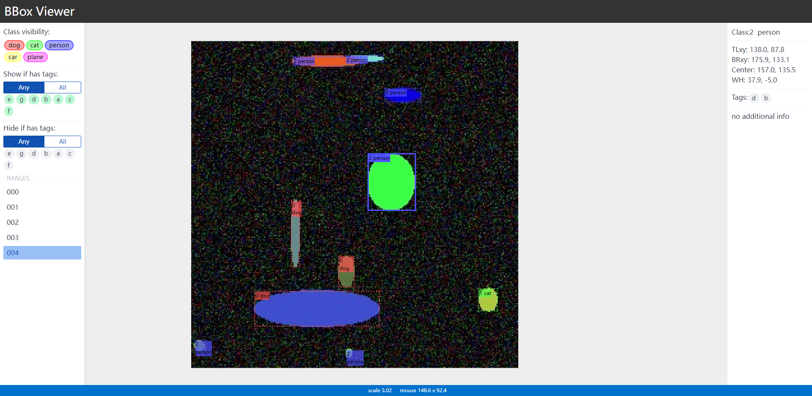

*交互式bbox可视化webui*

`ImageData`: 存放图像和bbox的数据结构

`visualize_generate_html`: 只在本地生成html页面，可以用浏览器打开

`visualize_start_server`: 阻塞并开启http server，可以远程访问

### Quickstart

``` python
from bboxi import ImageData, visualize_start_server

data = ImageData(img)
classes = ['dog', 'cat']
class_colors = [(255, 0, 0), (0, 0, 255)]
data.add_bbox((100, 100), (200, 200), 
    class_id=0, tags=['a', '123'], info='info here...')
data.add_bbox((100, 200), (200, 300), 
    class_id=1, tags=['bbb', '123'], info='info here...')
...

visualize_start_server([data], classes, class_colors, port=8080)
```

或者直接运行`python bboxi.py`，可以看到随机生成的demo




